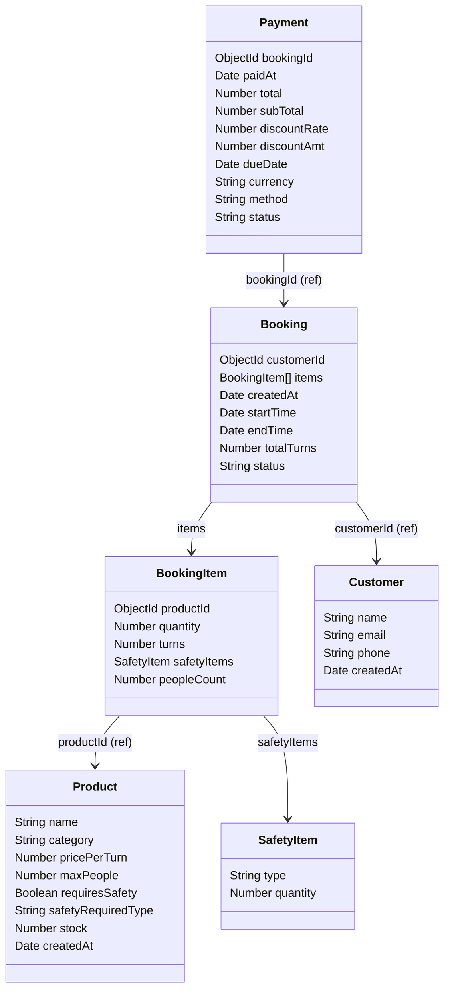

# 🛠️ Backend API con Node.js + MongoDB (Docker Ready)
Repo del backend para la materia de Full Stack Web Development

Este proyecto es una API backend desarrollada en **Node.js con TypeScript** que utiliza **MongoDB** como base de datos, ambos corriendo en **contenedores Docker**. Incluye carga de datos inicial para facilitar el desarrollo y pruebas.

---

## 🚀 Tecnologías utilizadas

- Node.js + TypeScript
- Express.js
- Mongoose (ODM para MongoDB)
- Docker + Docker Compose
- dotenv (manejo de variables de entorno)

---

## 📦 Requisitos previos

Asegurate de tener:

- [Docker](https://www.docker.com/)
- [Docker Compose](https://docs.docker.com/compose/)

---

## ⚙️ Instalación y ejecución

### 1. Cloná el repositorio

```bash
git clone https://github.com/LucasChch/backend-up-2025
cd backend-up-2025
```

### 2. Configurá las variables de entorno

```bash
cp .env-example .env
```

### 3. Levantá los servicios con Docker Compose

```bash
docker-compose up -d --build
```
---

## Consigna
Se requiere generar un sistema de gestión de alquiler de productos de playa para un parador en el caribe.
El parador cuenta con los siguientes productos para alquilar:
- JetSky
- Cuatriciclos
- Equipo de buceo
- Tablas de surf (para niños y para adultos)

Para el caso del alquiler de JetSky o cuatriciclos se deberá requerir el alquiler de casco y el jetsky un chaleco salvavidas (en ambos casos se pueden subir máximo 2 personas), por lo que se alquilará uno o dos dispositivos de seguridad según corresponda. 
La duración del alquiler para cualquiera de los productos es de 30 minutos por turno y un mismo cliente puede adquirir hasta 3 turnos consecutivos.
En el caso de contratar mas de un producto, se considerará un descuento del 10% en el total a pagar.
Los turnos se pueden tomar con una anticipación no mayor a 48 hs y podrán cancelarse sin costo hasta 2 horas del turno.
Se puede realizar el pago en el parador (efectivo) en ese caso este se deberá realizar 2 horas antes del turno de lo contrario el mismo se libera.
Se puede pagar en moneda local o bien en moneda extranjera.
Seguro de tormenta, en caso que el usuario no pueda disfrutar de su turno debido a una tormenta imprevista se le devolverá el 50% del valor abonado.

---
# 🔲 Modelo de dados


---

# 📚 API Endpoints

## 🧾 Booking

#### 📄 Obtener todas las reservas
**GET** `/booking`  
Retorna todas las reservas existentes.

#### 📝 Crear una reserva (caso de uso: *reservar*)
**POST** `/booking`  
Crea una nueva reserva con detalles de cliente, horario e items alquilados.

**Body de ejemplo:**
```json
{
  "customerId": "68031346e7c08857694d78a5",// cliente asociado a la reserva
  "startTime": "Mon Apr 30 2025 10:10:00 GMT-0300", // tiempo de inicio de la reserva
  "totalTurns": 3, // cantidad de turnos solicitados (min: 1, max: 3)
  "method": "card", // método de pago ['card', 'cash']
  "currency": "USD", // moneda ['ARS', 'USD', 'EUR']
  "amount": 22.5, // monto que paga el usuario
  "items": [ // lista de productos a reservar
    {
      "productId": "68031346e7c08857694d78ab", // id del producto
      "quantity": 1, // cantidad de productos
      "turns": 2, // turnos del producto a reservar
      "safetyItems": {"type": "chaleco", "quantity": 1}, // objetos de seguridad
      "peopleCount": 1 // cantidad de personas que utilizaran el producto
    },
    {
      "productId": "68031346e7c08857694d78ac",
      "quantity": 1,
      "turns": 1,
      "peopleCount": 1
    }
  ]
}
```
#### ❌ Cancelar una reserva (caso de uso: _cancelar reserva_)

**PATCH** `/booking/cancel/:bookingId`  
Marca una reserva como cancelada.

#### 💸 Solicitar reembolso (caso de uso: _reembolso de reserva_)

**PATCH** `/booking/refund/:bookingId`  
Inicia el proceso de reembolso de una reserva.

---
## 👤 Customer

#### 🔍 Obtener cliente por ID

**GET** `/customer/:id`  
Devuelve la información del cliente correspondiente al ID.

#### 📄 Obtener todos los clientes

**GET** `/customer`  
Devuelve la lista de todos los clientes registrados.

---

## 📦 Product

#### 📄 Obtener todos los productos

**GET** `/product`  
Retorna la lista completa de productos disponibles para alquilar.

---

## 💳 Payment

#### 📄 Obtener todos los pagos

**GET** `/payment`  
Devuelve el historial de pagos realizados.

#### 💵 Pagar la reserva en efectivo  (caso de uso: _pagar en efectivo_)

**POST** `/payment/payCash/:bookingId`  
Registra el pago en efectivo de una reserva existente.

**Body de ejemplo:**
```json
{
  "amount": 22.5,
  "currency": "USD",
  "method": "cash"
}
```
---
> ℹ️ Todos los endpoints usan `Content-Type: application/json`. En producción, se recomienda utilizar HTTPS y autenticación.


# 📐 Reglas de negocio

Esta sección describe comportamientos clave y validaciones que implementa el sistema más allá de lo técnico.

### 🧾 Reservas (`/booking`)

- Una reserva debe tener al menos un item que sería un `Product` .
- El campo `totalTurns` debe coincidir con la suma de `turns` de todos los productos.
- El cliente puede tener como máximo 3 turnos activos ( pueden ser en distintos horarios)
- Cada `productId` en la reserva debe existir previamente en la base de datos.
- Solo se puede reservar con 48 horas de anticipación.
- Cada reserva tiene asociado un pago `Payment` y un cliente `Customer`
- La reserva puede tener 3 estados `booked` (reservada), `refunded` (reembolsada) y `cancelled` (cancelada.

### 🧾 Productos (`/product`)
- Se deben especificar las pesonas a utilizar los productos `peopleCount`
- Si el producto lo requiere, se deben especificar los items de seguridad `safetyItems`
- El producto cuenta con un `stock`, si se supera ese máximo, no se puede reservar.
- El producto cuenta con el precio por turno `pricePerTurn`

### 💳 Pagos (`/payment`)

- El monto `amount` enviado por el usuario debe coincidir con el total calculado por la reserva.
- Si el método de pago es `card`, el pago se debe realizar en el mismo instante que se da de alta la reserva.
- Si el método de pago es `cash`, se puede realizar el pago en el momento o hasta 2 horas antes del inicio de la reserva. De lo contrario se cancela la reserva.
- El pago puede estar en estado `paid` (pagado), `refundedPartial` (se reembolso el 50%), `refundedTotal` (se reembolso el 100%) o `pendind` (pago pendiente).
- El intercambio de monedas es 1 'USD' = 1000 'ARS' --- 1 'EUR' = 1000 'ARS' 
- Se puede pagar con cualquier moneda, es indistinto.
- Si se reservan 2 o más  productos **distintos** hay un 10% de descuento.

### ❌ Cancelaciones (`/booking/cancel`)

- Las reservas con estado que se cancelen con una anticipación de 2 horas antes del inicio del turno, se les devolverá el 100% de la reserva (`refundedTotal`).
- Las reservas reembolsadas cambian su estado a `refunded`.


### ⛈️Reembolsos por tormenta (`/booking/refund`)
- En el caso de pedir reembolso por tormenta, se valida que la reserva haya sido pagada, y se re reembolsa el 50% de la reserva.
---
## 📥 Carga inicial de datos

El archivo `initdb.ts` inicializa la base de datos `rentaldb`, además de insertar datos en las colecciones de `Products` y `Customers` automáticamente **cada vez** que se levanta Mongo. Esto se puede modificar para profundizar más el funcionamiento de la aplicación.

---
## 🧪Primeros pasos para probar el rental
	 Una vez que nuestra aplicación está corriendo ('localhost:3000'), ya podemos ejecutar las primeras peticiones.
1.  Hacer un _get all_ de los clientes para ver sus id.
2.  Hacer un _get all_ de los productos para ver sus id.
3.  Con esta información ya podemos hacer nuestra primer reserva (con el body de ejemplo)

> 👌TIP! Para seguir probando la aplicación recomendamos fijarse en el archivo **api-test.http** donde se encuentran armados algunos endpoints de ejemplo para interactuar con la información del rental.
> Con la extensión de **REST Client** de visual studio code, este archivo permite ejecutar las peticiones desde aqui mismo.


# 👨‍💻 Autor

-   [Lucas Chialchia]((https://github.com/LucasChch))


